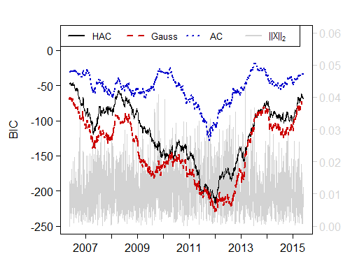

[](http://quantlet.de/index.php?p=info)

## [](http://quantlet.de/) **COPRollingBIC** [](http://quantlet.de/d3/ia)

```yaml

Name of Quantlet : COPRollingBIC

Published in : 'Time-varying Hierarchical Archimedean Copulas Using Adaptively Simulated Critical
Values'

Description : 'Plots the BIC calculated in a rolling window with r = 250 for hierarchical
Archimedean copula (HAC), Archimedean copula (AC) and Gauss copula. The HAC and AC are based on
Gumbel generators. In addition, the plot includes the dynamics of the parameters of HAC. It
includes dots where the structure of HAC changes and the L2 norm of the difference in the matrix of
dependence parameters. The data underlying the BIC are residuals from fitting GARCH(1,1) to log
returns of DAX, Dow Jones and Nikkei.'

Keywords : bic, copula, gumbel, HAC, nested Archimedean copula, plot

Author[New] : Ramona Steck

Datafile : BIC, dates

Example : 'BIC calculated in a rolling window for Gauss copula, AC and HAC including dynamics of
the parameters of HAC for the data at hand.'

```




```r
# clear all variables and close windows
rm(list = ls(all = TRUE))
graphics.off()

# specify working directory and load the data
# setwd("...")
BIC       = read.table("BIC")
BIC       = as.matrix(BIC)
dates     = read.table("dates")
dates     = dates[-c(1:5575), ]  
dates     = as.matrix(dates)
labels    = as.numeric(format(as.Date(dates, "%Y-%m-%d"), "%Y"))
where.put = c(which(diff(labels) == 1) + 1)

# The plot
par(mai = (c(0, 0.8, 0.1, 0.2) + 0.4), mgp = c(3, 0.5, 0))
plot_colours = c("black", "red3", "blue3", "light grey")
plot(BIC[, 3], pch = 15, xlab = "", ylab = "", ylim = c(0, 0.06), axes = FALSE, type = "l", col = plot_colours[4])
axis(4, ylim = c(0, 0.06), col = plot_colours[4], col.axis = "light grey", las = 1, cex = 0.8, tck = -0.02)
par(new = T)
plot(BIC[, 1], xaxt = "n", type = "l", xlab = "", ylab = "BIC", ylim = c(-250, 25), pch = 21, col = plot_colours[1], 
    las = 1, cex = 0.8, tck = -0.02)

# points where changes in structure
for (i in 2: dim(BIC)[1]) {
    if (BIC[i, 2] != BIC[(i - 1), 2]) {
        points(i, -250, pch = 19, col = "red")  
    }
}

axis(1, at = where.put, labels = labels[where.put], cex = 0.8, tck = -0.02)
lines(BIC[, 5], type = "l", pch = 22, lty = 2, lwd = 2, col = plot_colours[2])
lines(BIC[, 4], type = "l", pch = 23, lty = 3, lwd = 2, col = plot_colours[3])

# add legend
legend("topleft", c("HAC", "Gauss", "AC", expression("||X||"[2])), lty = 1:3, lwd = 2, col = plot_colours[1:4], 
    cex = 0.8, ncol = 4) 

```
