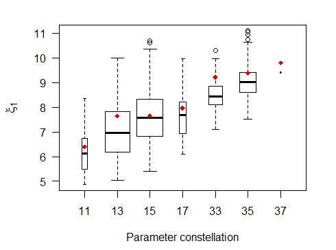
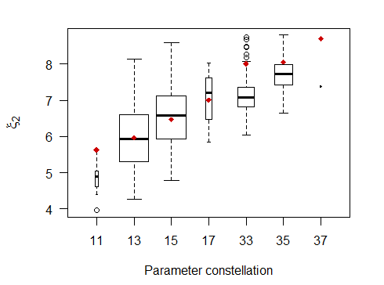
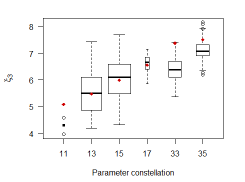
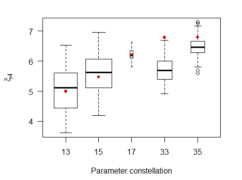

[](http://quantlet.de/)

## [](http://quantlet.de/) **COPlcpcompcv** [](http://quantlet.de/)

```yaml

Name of Quantlet : COPlcpcompcv

Published in : 'Time-varying Hierarchical Archimedean Copulas Using Adaptively Simulated Critical
Values'

Description : 'Plots the distribution of the adaptively simulated critical values around the
respective pre-simulated critical value for all test steps of LCP. The red points mark the
pre-simulated critical values.'

Keywords : copula, gumbel, HAC, nested Archimedean copula, critical-value, plot, boxplot

Author[New] : Ramona Steck

Datafile : Acv, Bcv, qx

Example: 
- 1: Boxplots for test step k = 1.
- 2: Boxplots for test step k = 2.
- 3: Boxplots for test step k = 3.
- 4: Boxplots for test step k = 4.

```










### R Code:
```r

# clear all variables and close windows
rm(list = ls(all = TRUE))
graphics.off()

# install and load packages
libraries = c("copula")
lapply(libraries, function(x) if (!(x %in% installed.packages())) {
    install.packages(x)
})
lapply(libraries, library, quietly = TRUE, character.only = TRUE)

# specify working directory and load chosen pre-simulated critical values
# setwd("...")
Acv = read.table("Acv")
Acv = as.matrix(Acv)

# adaptively simulated critical values
Bcv = read.table("Bcv")
Bcv = as.matrix(Bcv)

# critical value curves (pre-simulated)
qx = read.table("qx")
qx = as.matrix(qx)

Ak_max = 10

# boxplots in order to see how critical values are spread out
g = matrix(nrow = dim(Acv)[1], ncol = 10)
for (k in 1:Ak_max) {
    for (i in 1:dim(Acv)[1]) {
        for (j in 1:10) {
            if (is.na(Acv[i, k]) == TRUE) {
                g[i, k] = "NA"
            }
            if (is.na(Acv[i, k]) != TRUE) {
                if (Acv[i, k] == qx[j, k]) {
                  g[i, k] = rownames(qx)[j]
                }
            }
        }
    }
}

labels = c(expression(xi[1], xi[2], xi[3], xi[4], xi[5], xi[6], xi[7], xi[8]))

for (i in 1:8) {
    B = cbind(Acv[, i], Bcv[, i])
    B = round(B, 2)
    f = as.numeric(g[, i])
    B = cbind(B, f)
    par(mai = (c(0.8, 0.8, 0.1, 0.2) + 0.4), mgp = c(3, 1, 0))
    box1 = boxplot(B[, 2] ~ B[, 3], data = B, varwidth = TRUE, names, xlab = "", ylab = "", axes = T, 
        frame = T, las = 1)
    values = table(B[, 1])
    values = row.names(values)
    points(values, col = "red3", pch = 18)
    mtext(side = 2, text = labels[i], line = 3, cex = 1.2)
    mtext(side = 1, text = "Parameter constellation", line = 3, cex = 1)
} 

```
