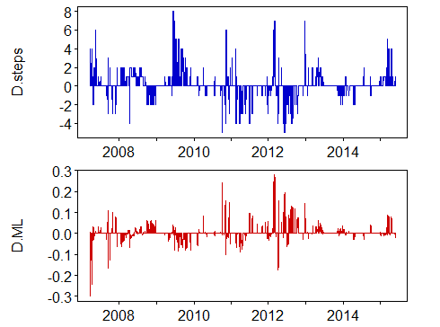

[](http://quantlet.de/index.php?p=info)

## [](http://quantlet.de/) **COPlcpdiffMLI** [](http://quantlet.de/d3/ia)


```yaml


Name of Quantlet: COPlcpdiffMLI

Published in: Time-varying Hierarchical Archimedean Copulas Using Adaptively Simulated Critical Values

Description: 'Calculates and plots the no. of different test steps per time point for the two approaches 
of LCP. The results from LCP correspond to the approach with pre-simulated critical values and the 
approach with adaptively simulated critical values. In addition, the dynamics of the difference in the ML 
criterion are plotted as well. The estimated model is a three-dimensional HAC with Gumbel generators.'

Keywords: copula, gumbel, HAC, nested Archimedean copula, plot

See also: 

Author: [New] + Ramona Steck

Submitted:  

Datafile: AGumbel, BGumbel, dates

Input: 

Output:  

Example: 


```





```R
# clear all variables and close windows
rm(list = ls(all = TRUE))
graphics.off()

# specify working directory and load results with pre-simulated critical values
setwd("...")
AGumbel = read.table("AGumbel")

# results adaptively simulated critical values
BGumbel = read.table("BGumbel")

# dates
dates     = read.table("dates")
dates     = dates[-c(1:5793), ]
dates     = as.matrix(dates)
labels    = as.numeric(format(as.Date(dates, "%Y-%m-%d"), "%Y"))
where.put = c(which(diff(labels) == 1) + 1)

a = c(1:9)
g = c(1:9)
for (k in 0:8) {
    g[k + 1] = trunc(40 * 1.25^k)
}

# no. of conducted test steps at corresponding timepoint for pre-simulated critical values
tstep = matrix(0, nrow = dim(AGumbel)[1], ncol = 1)
for (i in 1:dim(AGumbel)[1]) {
    for (j in 1:9) {
        if (AGumbel[i, 1] == g[j]) {
            tstep[i] = (a[j] + 1)
        }
    }
}

# no. of conducted test steps at corresponding timepoint for adaptively simulated critical values
tstep1 = matrix(0, nrow = dim(AGumbel)[1], ncol = 1)
for (i in 1:dim(AGumbel)[1]) {
    for (j in 1:9) {
        if (BGumbel[i, 1] == g[j]) {
            tstep1[i] = (a[j] + 1)
        }
    }
}

# differences of no. of test steps and ML for the two approaches
diff.test = tstep - tstep1
diff.ml   = AGumbel[, 5] - BGumbel[, 5]

# the plots
layout(matrix(1:2, nrow = 2, byrow = T))
par(mai = (c(0, 0.8, -0.3, 0.1) + 0.4), mgp = c(3, 0.3, 0))
plot(diff.test, type = "l", lwd = 1, col = "blue3", lty = "solid", axes = F, frame = T, xlab = "", ylab = "D.steps", 
    cex.lab = 1, yaxt = "n", xaxt = "n")
axis(2, tck = -0.02, las = 1, cex.axis = 1)
axis(1, at = where.put, labels = labels[where.put], tck = -0.02, cex.axis = 1)
plot(diff.ml, type = "l", lwd = 1, col = "red3", lty = "solid", axes = F, frame = T, xlab = "", ylab = "D.ML", 
    cex.lab = 1, yaxt = "n", xaxt = "n")
axis(2, tck = -0.02, las = 1, cex.axis = 1)
axis(1, at = where.put, labels = labels[where.put], tck = -0.02, cex.axis = 1) 

```
