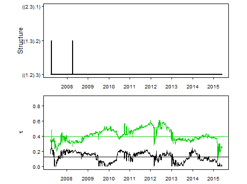
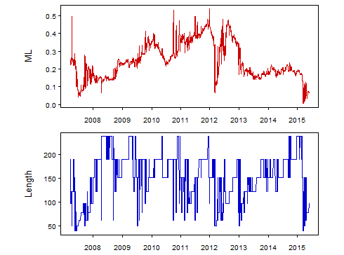
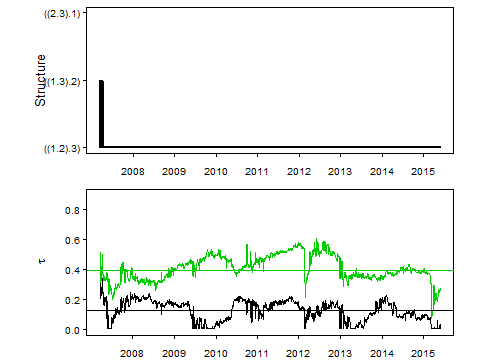
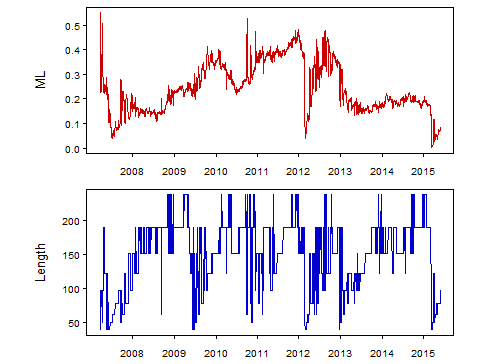

[](http://quantlet.de/index.php?p=info)

## [](http://quantlet.de/) **COPlcpgraphs** [](http://quantlet.de/d3/ia)

```yaml

Name of Quantlet : COPlcpgraphs

Published in : 'Time-varying Hierarchical Archimedean Copulas Using Adaptively Simulated Critical
Values'

Description : 'Plots the dynamics of structure, the dependence parameters, ML and the length of the
intervals of homogeneity for the LCP estimation results based on pre-simulated critical values (on
the one hand) and adaptively simulated critical values (on the other hand). The estimated model is
a three-dimensional HAC with Gumbel generators. The underlying data corresponds to residuals from
fitting GARCH (1,1) to log returns of DAX, Dow Jones and Nikkei.'

Keywords : copula, gumbel, HAC, nested Archimedean copula, plot

FALSE

Author : Ostap Okhrin, Simon Trimborn

Author[New] : Ramona Steck

FALSE

Datafile : AGumbel, BGumbel, dates, global.taus

FALSE

FALSE

Example: 
- 1: Structure and copula parameters for LCP with pre-simulated critical values.
- 2: ML criterion and length of interval of homogeneity for LCP with pre-simulated critical values.
- 3: Structure and copula parameters for LCP with adaptively simulated critical values.
- 4: 'ML criterion and length of interval of homogeneity for LCP with adaptively simulated critical
values.'

```










```r
# clear all variables and close windows
rm(list = ls(all = TRUE))
graphics.off()

# specify working directory and load results with adaptive critical values
#setwd("...")
BGumbel = read.table("BGumbel")

# load results with pre-simulated critical values
AGumbel = read.table("AGumbel")

# dates
dates     = read.table("dates")
dates     = dates[-c(1:5793), ]
dates     = as.matrix(dates)
labels    = as.numeric(format(as.Date(dates, "%Y-%m-%d"), "%Y"))
where.put = c(which(diff(labels) == 1) + 1)

# estimated global HAC dependence parameters
global.taus = read.table("global.taus")

# conversion of estimated structure
get.str = function(st) {
    if (st == 1) {
        a = "((1.2).3)"
    }
    if (st == 2) {
        a = "((1.3).2)"
    }
    if (st == 3) {
        a = "((2.3).1)"
    }
    a
}

# conversion of copula dependence parameter into Kendalls tau
theta2tau = function(theta, type = "gumbel") {
    if (type == "gumbel") {
        1 - 1/theta
    } else if (type == "clayton") {
        theta/(2 + theta)
    } else if (type == "gauss") {
        2/pi * asin(theta)
    }
}

# the functions for the plots
plot.param = function(A) {
    layout(matrix(1:2, nrow = 2, byrow = T))
    par(mai = (c(0, 0.8, -0.3, 0.1) + 0.4), mgp = c(2, 0.3, 0))
    plot(c(0, 0), c(0, 0), xlim = c(0, length(A[, 1])), ylim = c(1, 3), xlab = "", ylab = "Structure", 
        axes = F, frame = T, cex.lab = 0.8, yaxt = "n", xaxt = "n")
    lines(A[, 2], type = "l", lwd = 2, col = "black")
    axis(2, at = 1:3, labels = c(get.str(1), get.str(2), get.str(3)), tck = -0.02, las = 1, cex.axis = 0.6)
    axis(1, at = where.put, labels = labels[where.put], tck = -0.02, cex.axis = 0.6)
    plot(theta2tau(A[, 3]), ylim = c(0, 0.9), type = "l", lwd = 1, col = "black", lty = "solid", axes = F, 
        frame = T, xlab = "", ylab = expression(tau), cex.lab = 0.8, yaxt = "n", xaxt = "n")
    lines(theta2tau(A[, 4]), lwd = 1, col = "green3", lty = "solid")
    abline(a = global.taus[1, ], b = 0, col = "black")
    abline(a = global.taus[2, ], b = 0, col = "green3")
    axis(2, tck = -0.02, las = 1, cex.axis = 0.6)
    axis(1, at = where.put, labels = labels[where.put], tck = -0.02, cex.axis = 0.6)
}

plot.MLI = function(A) {
    layout(matrix(1:2, nrow = 2, byrow = T))
    par(mai = (c(0, 0.8, -0.3, 0.1) + 0.4), mgp = c(2, 0.3, 0))
    plot(A[, 5], type = "l", lwd = 1, col = "red3", lty = "solid", axes = F, frame = T, xlab = "", ylab = expression(ML), 
        cex.lab = 0.8, yaxt = "n", xaxt = "n")
    axis(2, tck = -0.02, las = 1, cex.axis = 0.6)
    axis(1, at = where.put, labels = labels[where.put], tck = -0.02, cex.axis = 0.6)
    plot(A[, 1], type = "l", lwd = 1, col = "blue3", lty = "solid", axes = F, frame = T, xlab = "", ylab = "Length", 
        cex.lab = 0.8, yaxt = "n", xaxt = "n")
    axis(2, tck = -0.02, las = 1, cex.axis = 0.6)
    axis(1, at = where.put, labels = labels[where.put], tck = -0.02, cex.axis = 0.6)
}

# call the plot for pre-simulated critical values
plot.param(AGumbel)
plot.MLI(AGumbel)

# call the plot for adaptively simulated critical values
plot.param(BGumbel)
plot.MLI(BGumbel) 

```
